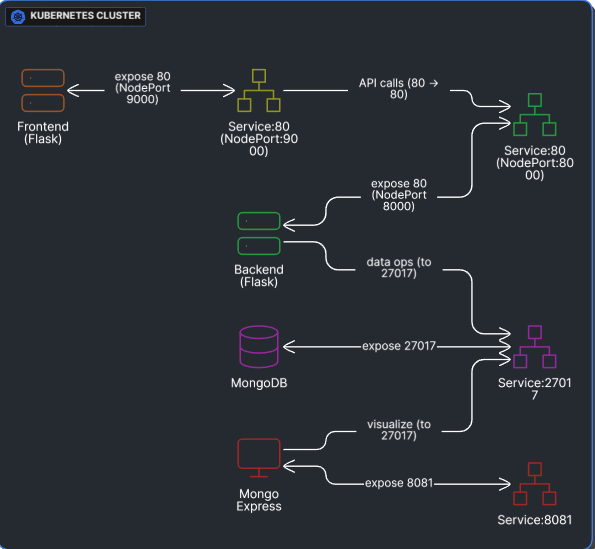

# 🚀 microservices-k8s-deployment

Lightweight demo of a simple microservices stack (**frontend + backend + MongoDB**) with Kubernetes manifests for local testing.

---

## 📂 Contents

* `frontend/` — Flask frontend that calls backend and renders a simple dashboard (`templates/index.html`).
* `backend/` — Flask backend that reads/writes simple values to MongoDB.
* `k8s/` — Kubernetes manifests for deploying the stack (`backend.yaml`, `frontend.yaml`, `mongo.yaml`, `mongo-express.yaml`, `ingress.yaml`).

---

## 🎯 Goals

* Small demo showing how to run a frontend and backend with MongoDB.
* Example Kubernetes manifests for local clusters (minikube, kind) or a small cloud cluster.
* Demonstrates **Ingress** configuration for routing multiple services on custom domains.

---

## 🖼️ Architecture Diagram

<div align="center">
  
  <p><em>Figure: High-level system architecture — frontend calls backend; backend stores data in MongoDB; <code>mongo-express</code> provides a DB UI; Ingress routes requests based on hostnames.</em></p>
</div>

---

## ⚙️ Requirements

* Python 3.8+ to run the services locally
* Docker (for container images) or a Kubernetes cluster (minikube/kind/managed)
* `kubectl` configured for your cluster
* NGINX Ingress Controller installed (for Ingress routing)

---

## 💻 Quick Local (no Kubernetes) — Recommended for Development

Start **MongoDB** (use 4.4 for older CPUs without AVX):

```bash
docker run -d --name mongo -p 27017:27017 mongo:4.4
```

Start **mongo-express** (UI):

```bash
docker run -d --name mongo-express --link mongo:mongo -p 8081:8081 \
  -e ME_CONFIG_MONGODB_SERVER=mongo \
  -e ME_CONFIG_MONGODB_PORT=27017 \
  -e ME_CONFIG_BASICAUTH=false \
  mongo-express
```

Run **backend**:

```bash
cd backend
pip install -r requirements.txt
export PORT=8000
export MONGO_HOST=mongo
export MONGO_PORT=27017
python app.py
```

Run **frontend**:

```bash
cd frontend
pip install -r requirements.txt
export PORT=9000
export BACKEND_URL=http://localhost:8000
python app.py
# open http://localhost:9000
```

📌 Notes:

* The backend exposes `GET /api/add/<name>` and `/api/get` used by the frontend.
* The frontend template includes a small UI to add names and view env variables.

---

## 🐳 Running with Docker Images

Build images and run containers:

```bash
docker build -t prajwalmalokar/backend:latest ./backend
docker build -t prajwalmalokar/frontend:latest ./frontend
```

Run with proper environment variables and a custom Docker network if needed.

---

## ☸️ Kubernetes Deployment

Apply the manifests in `k8s/`:

```bash
kubectl apply -f k8s/mongo.yaml
kubectl apply -f k8s/mongo-express.yaml
kubectl apply -f k8s/backend.yaml
kubectl apply -f k8s/frontend.yaml
kubectl apply -f k8s/ingress.yaml
```

### Ingress Configuration (`k8s/ingress.yaml`)

The provided Ingress manifest routes based on hostname:

* `prajwalonline.tech` → **frontend** service
* `backend.prajwalonline.tech` → **backend** service
* `express.prajwalonline.tech` → **mongo-express** service

Example:

```yaml
apiVersion: networking.k8s.io/v1
kind: Ingress
metadata:
  name: app-ingress
  annotations:
    kubernetes.io/ingress.class: nginx
spec:
  rules:
  - host: prajwalonline.tech
    http:
      paths:
      - path: /
        pathType: Prefix
        backend:
          service:
            name: frontend
            port:
              number: 80
  - host: backend.prajwalonline.tech
    http:
      paths:
      - path: /
        pathType: Prefix
        backend:
          service:
            name: backend
            port:
              number: 80
  - host: express.prajwalonline.tech
    http:
      paths:
      - path: /
        pathType: Prefix
        backend:
          service:
            name: mongo-express
            port:
              number: 80
```

📌 Notes:

* Update DNS A records of your domain (`prajwalonline.tech`) to point to the LoadBalancer IP/hostname of the Ingress Controller.
* For Minikube, run: `minikube tunnel` to expose the LoadBalancer.
* For cloud providers (AWS/GCP/Azure), a LoadBalancer will be automatically provisioned.

### Accessing services:

* `http://prajwalonline.tech` → Frontend
* `http://backend.prajwalonline.tech` → Backend API
* `http://express.prajwalonline.tech` → Mongo Express

---

## ⚠️ Important Notes

* MongoDB **5.0+ requires CPUs with AVX support**. Use `mongo:4.4` for local/dev if unsupported.
* `ME_CONFIG_MONGODB_SERVER` should be the Mongo service name. Use `ME_CONFIG_MONGODB_PORT` for port.
* Ensure DNS records match your Ingress hostnames for external access.

---

## 📜 License

This repository contains example code for **demo purposes**.